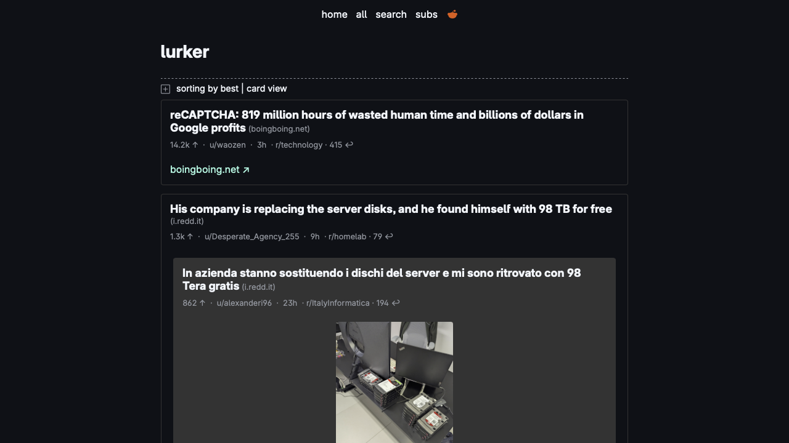
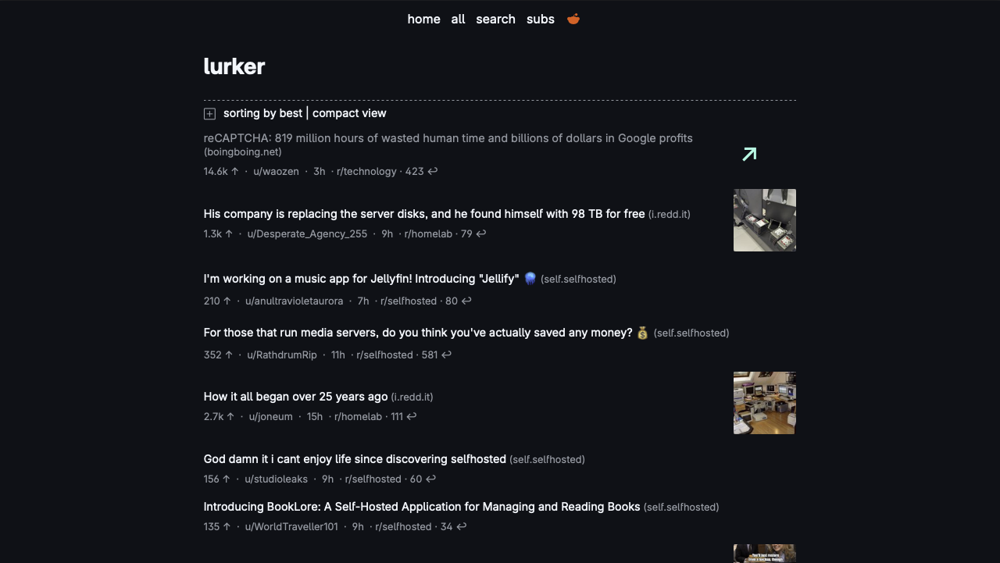
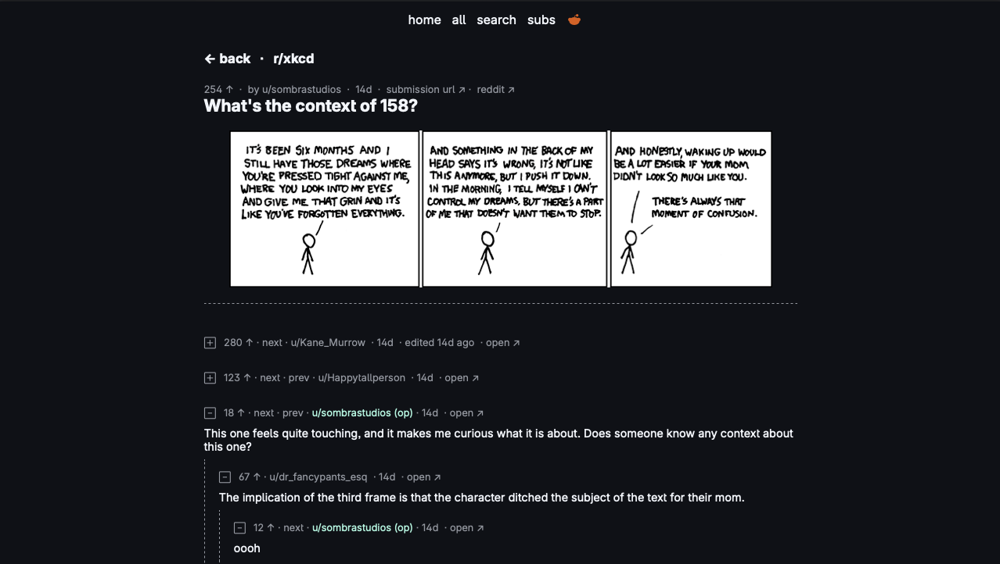
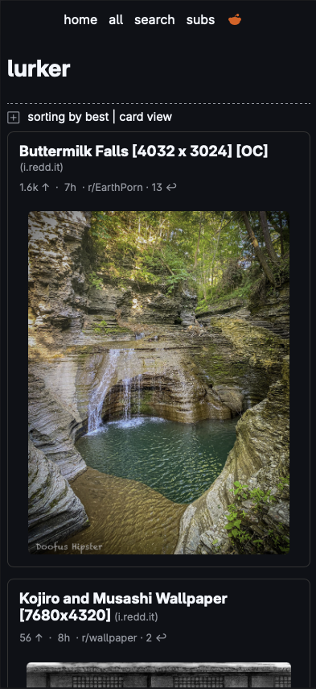

# lurker

lurker is a selfhostable, read-only reddit client, forked from [oppiliappan/lurker](https://github.com/oppiliappan/lurker)

It is better than [`old-reddit`](https://old.reddit.com) because:

- it renders well on mobile
- it respects `prefers-color-scheme`
- no reddit account necessary to subscribe to subreddits
- no reddit account necessary for over-18 content

## Features

- minimal use of client-side javascript
- card and compact views
- pagination
- allows automatic collapsing of `automod` comments
- multireddit support
- crosspost support
- extensible support for popular 3rd-party media (imgur images and galleries, xkcd, etc.)
- automatic media link expansion
- account-based subscription system
- invite-only user management
- comment collapsing, jump-to-next/prev comment
- "search on undelete" url for deleted comments
- over-18, spoiler content hidden by default

### Gallery

|  |  |
| ---------------------------------------------------- | ------------------------------------------------------ |
| Card view, dark theme                                | Card view, light theme                                 |

|  |  |
| ---------------------------------------------------------- | -------------------------------------------------------------------------------- |
| Compact view, dark theme                                   | Compact view, expanded media, dark theme                                         |

|  |  |
| ------------------------------------------------------------ | ------------------------------------------------------------- |
| Comments view, dark theme                                    | Subscriptions view,dark theme                                 |

|  |  |
| ------------------------------------------------------------------- | ------------------------------------------------------------------------- |
| Card view, mobile, dark theme                                       | Compact view, mobile, dark theme                                          |

## Setup

### Docker Desktop

> [!TIP]
> lurker stores data in /data, so create a volume mount on the host accordingly

```bash
# Pull (if necessary) and start lurker in a detached container
docker run --detach --volume /your/host/lurker-data:/data --publish 3000 ghcr.io/portableprogrammer/lurker:latest
```

### Docker Compose

> [!TIP]
> lurker stores data in /data, so create a volume mount on the host accordingly

```yaml
version: '3'
services:
  lurker:
    image: ghcr.io/portableprogrammer/lurker:latest
    container_name: lurker
    volumes:
      - /your/host/lurker-data:/data
    ports:
      - "3000:3000"
```

### Bun

Start lurker with just [bun](https://bun.sh/)

```bash
bun run /path/to/lurker/src/index.js
```

### NixOS

Run lurker as a `systemd` service on NixOS

```nix
inputs.lurker.url= "git+https://github.com/portableprogrammer/lurker";
  .
  .
  .
services.lurker = {
  enable = true;
  port = 9495;
};
```

## Usage

> [!CAUTION]
> Upon first run, lurker initializes its database and then is open to registration without authentication.
>  Ensure you have appropriate controls in place to restrict access until the first admin account is created. <!-- markdownlint-disable-line MD027 -->

lurker is open to registrations when first started.
Navigate to `/register` and create an account, which will be an admin account.
Click on your username at the top-right to view the dashboard and to invite other users to your instance.

## Technical

lurker uses an SQLite database to store accounts, invites, preferences, subscriptions, etc.
It creates `lurker.db` in the local (or, in the case of containers, `/data`) directory. There is no way to configure this right now.

### Development

#### VS Code

Use the included [`devcontainer`](.devcontainer/devcontainer.json) in [VS Code](https://code.visualstudio.com/docs/devcontainers/containers) or any other IDE that [supports](https://containers.dev/supporting) it.

> [!TIP]
> When using devcontainers, you may want to forward the lurker devcontainer port externally (e.g. to use a mobile device to test); you can easily do so with another Docker container.

```bash
# In a separate shell

# Get the running containers
$ docker ps
CONTAINER ID   IMAGE             COMMAND                  CREATED       STATUS        PORTS     NAMES
eda5e926106f   vsc-lurker-xxxx   "/bin/sh -c 'echo Co…"   3 weeks ago   Up 13 hours             stupefied_dirac

# Get the IP address of the vsc-lurker-xxxx container
$ docker inspect stupefied_dirac | jq '.[0].NetworkSettings.IPAddress'
"172.17.0.2"

# Start an attached socat proxy container to forward the traffic
$ docker run --rm -p 8080:1234 verb/socat TCP-LISTEN:1234,fork TCP-CONNECT:172.17.0.2:3000
```

You can now browse your lurker devcontainer instance remotely via `http://<host_ip>:8080/`. When finished, kill the attached container using `Ctrl-C` to stop port-forwarding.

#### Nix

```nix
nix shell .#        # get a devshell
nix build .#lurker  # build the thing
```
